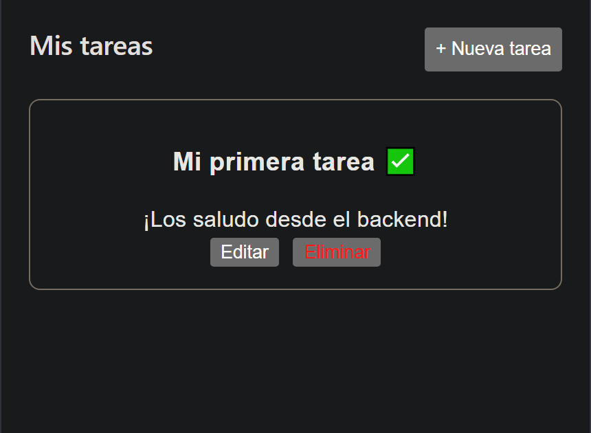
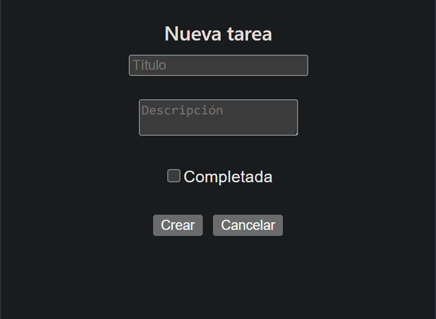

# TODO

Esta es una aplicación web fullstack para la gestión de tareas personales, desarrollada como parte de una prueba técnica para el ingreso a la Academia ForIT. Permite realizar las operaciones CRUD básicas (Crear, Leer, Actualizar y Eliminar) sobre notas, con un frontend interactivo y un backend persistente en memoria.





## Tecnologías Utilizadas

El proyecto fue construido utilizando un stack moderno enfocado en la escalabilidad y el tipado fuerte:

* **Frontend:**
    * React (con Vite)
    * TypeScript
    * React Router Dom (para la navegación)
    * ESLint (para la calidad del código)
* **Backend:**
    * Node.js
    * Express
    * TypeScript

---

Para correr este proyecto, seguí estos pasos:

### Prerrequisitos
* Tener instalado [Node.js](https://nodejs.org/) (versión 18 o superior recomendada).

### Instalación y Ejecución

1.  **Cloná el repositorio:**
    ```bash
    git clone "https://github.com/haruita/todo.git"
    cd "todo"
    ```

2.  **Instalá todas las dependencias (Monorepo setup):**
    Desde la raíz del proyecto, ejecutá el script que instala dependencias tanto para el frontend como para el backend:
    ```bash
    npm run install:all
    ```
    *(Nota: Este script debe estar definido en el package.json de la raíz).*

3.  **Iniciá ambos servidores simultáneamente:**
    Ejecutá el siguiente comando en la raíz para levantar el frontend (Vite) y el backend (Express) al mismo tiempo:
    ```bash
    npm run dev
    ```

La aplicación frontend estará disponible en `http://localhost:5173` y la API backend en `http://localhost:3000`.

---

## Notas de Desarrollo

* **Persistencia:** Los datos se manejan en memoria en el backend para este challenge. Reiniciar el servidor del backend borrará las notas creadas, volviendo a la nota de prueba inicial.
* **Tipado:** Se utilizó TypeScript en todo el proyecto (frontend y backend) para garantizar la integridad de los datos, definiendo interfaces claras para el objeto `Task`.
* **Estructura de Carpetas:**
    * `/frontend`: Contiene la aplicación React (Vite).
    * `/backend`: Contiene la API Express (Node).
    * `/screenshots`: Capturas de pantalla de la aplicación funcionando.

---
